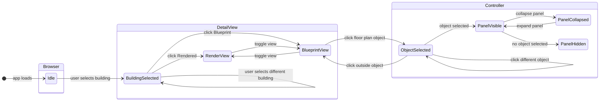

# Reactive Sandbox

**AI 201 — Creative Computing with AI | SCAD Spring 2026**  
Project 2: Three-Panel State Machine

---

## Overview

An interior design explorer built as a three-panel reactive system. Users select a building, view it in rendered and blueprint form, and interact with objects to inspect measurements and adjust materials.

**Architecture:** Browser → Detail View → Controller  
**Stack:** React 18 + Vite, hosted on GitHub Pages via GitHub Actions

---

## State Machine Diagram



---

## Panels

| Panel | Role |
|-------|------|
| **Browser** | Browse and select buildings, filter by type |
| **Detail View** | View selected building (render + blueprint), click objects |
| **Controller** | Inspect selected object — measurements and material controls |

---

## Local Development

```bash
npm install
npm run dev
```

Runs at `http://localhost:5173/ReactiveSandbox/`

---

## Deployment

Pushes to `main` automatically build and deploy to GitHub Pages via `.github/workflows/deploy.yml`.

---

## Project Documentation

Assignment docs and course reference are in `claude/docs/`.

---

## AI Direction Log

| # | Date | What I asked | What AI produced | What I changed / kept / rejected |
|---|------|-------------|-----------------|----------------------------------|
| 1 | 2026-04-21 | Build the three-panel layout with a Browser, Detail View, and Controller | React component scaffold with CSS variables, collapse buttons, and panel state wiring | Kept the structure; directed specific widths, colors, and typography to match design intent |
| 2 | 2026-04-26 | Add clickable SVG overlays on the floor plan objects (sofa, kitchen, dining table, etc.) | Path-matching system that extracts SVG coordinates from object files and maps them to floor plan paths, generating per-object overlay components | Kept the technique; directed which objects to prioritize and iterated on hitArea positions |
| 3 | 2026-04-26 | Add twin beds that share the same right-side panel | Two separate overlay components (TwinBed1/2Overlay) with a shared `panelId` field routing to one panel | Kept as-is |
| 4 | 2026-04-26 | Fix the "light purple block" appearing on the right side when no object is selected | Diagnosed that `controller--hidden` had `background: transparent`, revealing the warm canvas color behind the white detail view; fixed to `#ffffff` | Kept the fix |
| 5 | 2026-04-26 | Fix the collapse button shifting position when the panel minimizes | Multiple rounds — first attempts zeroed padding incorrectly; final fix changed collapsed `padding-top` from 10px to 0 on both panels | Directed to fix the right panel after the left was fixed |
| 6 | 2026-04-26 | Add deck table overlay, then separate chair overlays so they don't overlap | Produced DeckTableOverlay + 4 individual DeckChairOverlays; after chairs were added, adjusted hitArea alignment and render order so chairs intercept clicks before the table | Directed the overlap fix after noticing chairs were being swallowed by the table hit zone |
| 7 | 2026-04-27 | Add bathroom and utility overlays (bathtub, sink, laundry machine, basket) | Generated overlays via floor plan path-matching for each object | One unmatched path in BathtubOverlay caused a JSX build error; directed the fix |
| 8 | 2026-04-27 | Add lounge chairs and stairs | LoungeChair1/2Overlay and StairsOverlay, all 100% path-matched | Kept as-is |
| 9 | 2026-04-27 | Redo the twin bedroom closet with an updated SVG | Replaced TwinClosetOverlay with new file (52/53 paths matched), updated hitArea to match new position | Kept as-is |
| 10 | 2026-04-27 | Fine-tune right-side panel content positions (panelOffset, previewScale, dimsOffset) across many objects | Iterative numeric adjustments per object | Directed all values through multiple rounds of iteration |

---

## Records of Resistance

_Moments where I rejected or reverted AI output._

1. **2026-04-26 — Left panel button font revert.**
   - **What AI produced:** Changed the floor level buttons (Blueprint, Rendered, Ground Floor, etc.) to Inter Medium font as directed.
   - **Why rejected:** After seeing it rendered, the previous style looked better and the change wasn't an improvement.
   - **What I did instead:** Asked AI to revert to the prior font style.

2. **2026-04-26 — Sofa hover masking approach revert.**
   - **What AI produced:** An approach to mask the hover state to the sofa shape using the floor plan PNG — but the overlay didn't align to the sofa's actual position on screen.
   - **Why rejected:** The overlay was visually incorrect and not clipped to the sofa shape.
   - **What I did instead:** Asked AI to revert, then provided the full floor plan SVG and then the individual Sofa.svg so the path coordinates could be extracted accurately.

3. **2026-04-26 — Coffee table panel image scale revert.**
   - **What AI produced:** Scaled the coffee table's right-panel image to match the sofa's panel image size, which caused the sofa's panel image to be cut off when selected.
   - **Why rejected:** Changing the coffee table scale modified shared CSS that also affected the sofa preview — a side effect I didn't want.
   - **What I did instead:** Reverted and then asked AI to scale only the coffee table panel image down using the object-specific `previewScale` field.

4. **2026-04-26 — Rug overlay approach revert and removal.**
   - **What AI produced:** A rug overlay that tried to clip away the sofa and coffee table hover states in its area, which caused the sofa hover to break entirely in that region.
   - **Why rejected:** The clipping made the rug overlay look like there was nothing there and disrupted neighboring overlays.
   - **What I did instead:** Reverted the clip approach, then decided to remove the rug as a clickable object entirely to preserve the sofa interaction.

5. **2026-04-26 — Kitchen overlay wrong object.**
   - **What AI produced:** Wired the kitchen overlay to the twin beds location instead of the kitchen counter to the right of the dining table.
   - **Why rejected:** It was the wrong object entirely — the overlay appeared on the opposite side of the floor plan from the kitchen.
   - **What I did instead:** Told AI the correct location and provided the kitchen SVG again; AI re-matched the paths to the correct floor plan region.

6. **2026-04-26 — King bed overlay wrong wall.**
   - **What AI produced:** Placed the king bed overlay on the wrong wall — near the kitchen side rather than the opposite wall of the bedroom.
   - **Why rejected:** Visually confirmed it was sitting on top of the wrong area of the floor plan.
   - **What I did instead:** Told AI "It should be on the opposite wall of where the kitchen is"; AI re-matched to the correct location.

7. **2026-04-26 — Deck table height increase (reverted).**
   - **What AI produced:** When I asked to increase the deck table hitArea height by 23%, AI set it to 40% instead.
   - **Why rejected:** The larger height displaced the SVG overlay from its floor plan position — hitArea changes shift the coordinate mapping, so a large jump breaks alignment.
   - **What I did instead:** Asked AI to revert; it restored the height to 17%.

8. **2026-04-26 — Deck table ghost copy.**
   - **What AI produced:** After I asked AI to trim 15px and then 10px from the left of the deck table hitArea, it moved the div position without updating the SVG viewBox to match. The SVG paths still mapped to the original coordinate origin, rendering offset from the floor plan — appearing as a ghost duplicate.
   - **Why rejected:** The deck table appeared twice on screen: once correctly on the floor plan, and once as an offset ghost.
   - **What I did instead:** Caught the misalignment and directed AI to restore the hitArea to match the viewBox, then reorder the buildings.js array so chairs render on top of the table and intercept clicks first.

9. **2026-04-26 — Bedroom plant preview scale revision.**
   - **What AI produced:** Set the bedroom plant panel image scale to 0.9 when I asked it to scale down.
   - **Why rejected:** 0.9 was still too large relative to the panel space.
   - **What I did instead:** Directed it to 0.85. Small difference, but I made the visual call rather than accepting the first value.

10. **2026-04-27 — Deck chair preview scale revision.**
    - **What AI produced:** Set the deck chair panel image scale to 0.85 as directed.
    - **Why rejected:** After seeing it, 0.85 was still slightly too large in the panel.
    - **What I did instead:** Changed it to 0.8 on review.

---

## Five Questions

_Answered before submission._

**1. Can I defend this?**

I can defend this because each design decision connects back to my original goal of creating an interior design software that guides users through property selection, floor plan viewing, and interacting within the space. Keeping in mind the project brief, I designed the left side panel to function as the property search and floor plan options while the right side panel is meant to support object information display without overcrowding the main floor plan. I used familiar and universal UI patterns such as collapsible side panels, selected and hover states to help users orient themselves to the site quickly.

**2. Is this mine?**

This is mine because the concept, user flow, and visual design were thought out and created through my own interpretation and design process. I made my own decisions about the brand, layout, interaction model, and final interface. This project is a reflection of my own decision and work as everything from the color palette, button appearance, and typography were selected and curated based on my vision. Not only that but all the interactions from hover states, user flows, and component changes were directed by me.

**3. Did I verify?**

I did verify my project by consistently reviewing the user flows and ensuring that each interaction worked and made sense based on my design intent. I made sure that users were able to move from looking up a home, selecting a property, choosing a floor plan, and view the objects within the space. I also checked that all hover states and selected states, side panel interactions, and clickable components matched the way I intended the prototype to work.

**4. Would I teach this?**

I believe I have enough knowledge about this project to teach it to someone else, especially having gone through the trials and errors myself. I could teach about how the interface is structured, why the panels are organized and designed the way they are, and how the user moves through the main flow. I could also explain how AI was used as a supporting tool for coding and building, while the design direction and decision remained mine.

**5. Is my documentation honest?**

My documentation is honest because it accurately shows how the project developed, including what I created myself and where I used AI for support. In my AI Direction Log, I would document the prompts I gave, the changes I accepted, and the parts I had to revise. I also make it clear that the interface was designed in Figma by me, while AI was used to help execute the design. This keeps the process transparent and shows that AI supported my workflow instead of replacing my creative decisions.
